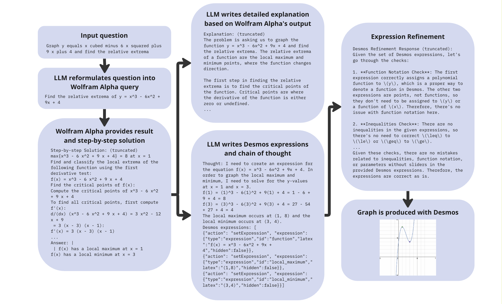
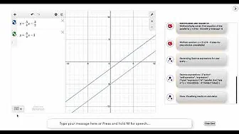
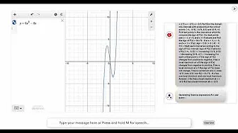
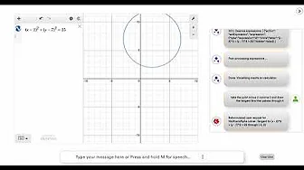

# MathViz-E

MathViz-E is an agent-based system which provides voice-driven automated math graphing. The system consists of three interacting LLM-based agents:
- An agent that interacts with a math solver, currently [WolframAlpha](https://www.wolframalpha.com/)   
- An agent that interacts with a visual calculator, currently [Desmos Graphical Calculator](https://www.desmos.com/calculator)
- An orchestrator agent which interacts with the user interface, and the solver and calculator agents

The agents complement each other. The solver agent can perform computations that are too complex for the LLM (currently [gpt4-turbo-preview](https://platform.openai.com/docs/models/gpt-4-and-gpt-4-turbo)) to solve reliably (like computing the tangent to a circle passing through a given point). On the other hand the orchestrator can reformulate queries into a form that is understandable by the solver. Finally, the visual calculator provides multimodal graphing capbilities. The combination allows the system to produce accurate graphs even for difficult, multi-step problems requiring complex reasoning.

An immediate use-case is in-classroom math pedagogy for K-12. Visual graphing is an integral part of math education, allowing students to visualize and interact with mathematical concepts. Visual calculators are used to teach several [Common Core](https://corestandards.org/mathematics-standards/) learning objectives. Pedagogical agents like MathViz-E hold the promise of untethering teachers by enabling natural language-based operation of classroom tools, enabling teachers to spend more time teaching and interacting with students.

Beyond the immediate pedgogical use-case, MathViz-E is an example of the broader class of [AI agent systems](https://blog.emergence.ai/2024/03/17/Introducing-Emergence.html) that are poised to fundamentally transform AI's impact on our everyday lives, and how we interact with technology. To learn more, check out our [blog posts](https://blog.emergence.ai/).



## Configuration

1. Rename `src/env.dist` to `src/.env`.

2. In `src/.env`, add your `OPENAI_API_KEY` and `WOLFRAM_APP_ID`.

3. In `src/.env`, add your `DESMOS_API_KEY`. As an example, you can use the public key [here](https://www.desmos.com/api/v1.8/docs/index.html).

4. In `src/.env` set `USE_EXPRESSION_VALIDATION` to `True` or `False`.
- If `True` the agent uses a self-critique vaidation to fix common errors (generally related to Desmos API requirements e.g. using `le` instead of `leq` for inequalities). This produces more accurate outputs, but at the expense of significant latency. 
- Set to `False` is you prefer quicker responses, at the epense of occasional errors, that can be manually fixed in the Desmos calcualtor.

## Running the Agent

### Option A. Using Docker:

1. Run docker e.g., via [Docker Desktop](https://www.docker.com/products/docker-desktop/)

2. In `src/.env`, set the `USE_DOCKER` flag to `True`.

3. On Linux/Mac: In the project root folder run `source run.sh`.

4. On Windows: In the project root folder, run:
```
docker build -t my_desmos .
docker run -p 5001:5001 my_desmos
```

### Option B. Using python and conda:

1. Create a virtual environment with python v3.11. For example, if you're using [Anaconda](https://www.anaconda.com/download)
```
conda create -n math_agent python=3.11 pip
conda activate math_agent
```

2. Install requirements inside the environment
```
pip install -r requirements.txt
``` 

3. In `src/.env`, set the `USE_DOCKER` flag to `False`.

4. In the root folder run `python -m src.main`.  

### Option C. Using python and virtualenv

1. In `src/.env`, set the `USE_DOCKER` flag to `False`.

2. Install Python virtual environemnt 
```
pip install virtualenv
```

3. Go to the project directory and create the virtual environment
```
cd <PROJECT_ROOT_DIR>
python3.11 -m venv env
```

4. Activate the virtual environment
```
source env/bin/activate
```

5. Install requirements inside the environment
```
pip install -r requirements.txt
```

6. Run the application
```
python -m src.main
```

## To invoke the agent

In your browser, go to `http://localhost:5001/desmos/`. Tested on Chrome and Firefox; use Chrome to enable the voice-interface. 

## Demos

These are some demonstrations of multi-turn interactions with MathViz-E. There are several other types of mathematical concepts that the system can be used for. See the test cases in `\tests\` for many other examples of the categories of problems that MathViz-E can solve. 

| Video  | Description |
| --- | --- |
| [ ](https://www.youtube.com/watch?v=lHGYYWep9AQ) | Transformation of shapes: <ul><li>Graphing a parametric shape</li> <li>Transformations mapped to parameter changes</li></ul>|
| [ ](https://www.youtube.com/watch?v=af1Buiweowk) | Lines: <ul><li>Graphing lines</li> <li>Computing and graphing perpendicular and parallel lines</li></ul>|
| [ ](https://www.youtube.com/watch?v=RjP3EUgGTmo) | Polynomials, extrema and derivative: <ul><li>Graphing a polynomial</li> <li>Finding and mapping local extrema</li> <li>Computing and mapping the derivative</li></ul>|
| [ ](https://www.youtube.com/watch?v=CmU55A8-YVM) | Circles and tangents: <ul><li>Graphing a circle</li> <li>Computing and plotting the pair of tangents that pass through a given point</li></ul>|

## Tests

To run the system on a wide variety of single and multi-turn examples, you can run the provided test-scripts in the root-folder, on the examples in the `test` directory:
```
# single-turn tests
source run_single_turn_tests.sh
# multi-turn tests
source run_multi_turn_tests.sh
```
Note that this takes a long time and requires many calls to the LLM (`gpt4-turbo-preview`). Also note that accuracy is significantly higher if you set `USE_EXPRESSION_VALIDATION` to `True` in `src/.env`.

The test scripts produce output csv files with Desmos expressions, by default in the `test/output` folder. Evaluating the correction of these expressions is currently manual. We're in the process of adding an autoevaluator which uses the LLM and [Sympy](https://www.sympy.org/en/index.html) to automate evaluation.

## TODO

Known issues and todos:
- Support for polygons and non-parametric shapes: MathViz-E currently relies on the Desmos `setExpressions` API, which does not handle non-parametric shapes. Support for polygons etc. requires the use of other Desmos APIs like `polygon()`.
- Unhandled classes of problems and Wolfram solver output: Other classes of problems that the system does poorly at include tangents to parabolas, and labeling certain types of intersections. A common theme in these errors is that Wolfram's output varies across classes of problems; we currently take Wolfram's output from the "Step-by-step solution" pod, but for some categories of problems this is incorrect. Wolfram output interpretation needs to be made more robust. 
- Graph retention over multi-turn interaction: Selecting which graphs to retain and which to remove, over the turns of a multi-turn interaction is non-trivial and needs to be made more robust. For example, "Move the shape to x,y" should probably remove the previously graphed shape, while "Plot the asymptote to the function" should probably retain the previously graphed function.
- Natural language interfaces for the solver and calculator agents: Currently the orchestrator invokes the solver and calculator agents through member functions. We'd like to move to invocation via natural language interfaces.
- Transition to Autogen or an equivalent framework: Related to the above (natural language interfaces), we plan to transition the system to a multi-agent framework like [Autogen](https://microsoft.github.io/autogen/)
- Autoevaluator: Currently, accuracy evaluation of the system is done manually. An AI-critique based autoevaluator would signifcantly simplify this; we're looking at a SymPy + LLM based auto-evaluator.
- Faster self-critique: The curent self-critique (when `USE_EXPRESSION_VALIDATION` is set "True") is slow and needs to be made more efficient. Also, the alternative rule-based post-processing is rather limited currently. One possibility is to combine the validation checks in the initial query prompt, to reduce the number of LLM invocations; another is to promotp the LLM to generate shorter responses, perhaps by limiting CoT.
- Latency and fine-tuned LLMs: The system uses GPT4, which can be high-latency and expensive. Fine-tuning smaller open-source LLMs like Mistral or Llama would mitigate this.
- Speech recognition issues: The system uses the [MDN Web Speech API](https://developer.mozilla.org/en-US/docs/Web/API/Web_Speech_API) for speech recognition. This has known issues with certain graphing utterances, for example, it often mis-transcribes words like "comma"  and "cubed".

## Contributing

Thank you for your interest in contributing! We welcome involvement from the community.

Please visit our [contributing guidelines](CONTRIBUTING.md) for more details on how to get involved.

## Misc
The UI uses icons and product names for the solver and calculator. This is for demonstration only, and all trademarks belong to the original owners.
